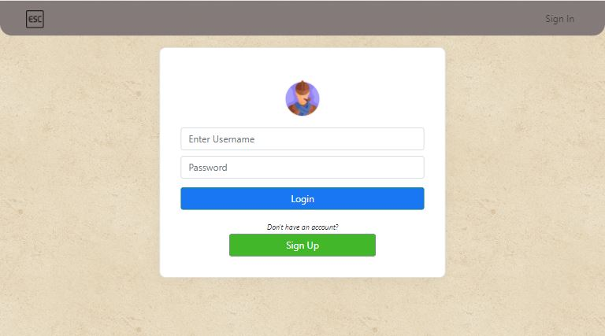

# Project: Virtual Rooms

    

"People bond when they are having fun."

# Introduction
Virtual Rooms is a platform where users can look for virtual activities to participate in. In addition, small business owners/vendors can advertise their virtual activities for users to book/purchase as well. Virtual activities can range from Escape Rooms, Murder Mysteries, Amazing Races, etc.

The project was designed to improve the social interactions in our increasing digitalized world. It aims to provide a platform which provides ease of access to virtual activities by users as well as a platform that provides convenience for vendors to advertise their services, manage their orders and payments.

# Index
1. [First Look](#first-look)
    - [User](#user)
    - [Vendor](#vendor)
2. [Technologies Used](#technologies-used)
3. [Quick Start](##quick-start)
4. [UI/UX](#uiux)
5. [Mobile Responsiveness](#mobile-responsiveness)
6. [Database Design](#database-design)
7. [Test Cases](#test-cases)
8. [Work-In-Progress & Bugs](#work-in-progress--bugs)
9. Deployment (learning)
10. [Credits & Acknowledgements](#credits--acknowledgements)

<video src='project03vid.mp4' width=180 />
# First Look
## User
<h3 align="center" >Main Page</h3>

    <!--  -->

 

<h3 align="center">Login & Sign Up Page</h3>

<!-- 
 -->

 

<h3 align="center" >Product Info Page (for booking)</h3>

    <!--  -->

 

<h3 align="center" >Cart Page (for checkout)</h3>

    <!--  -->

 

## Quick Start
- Deployed Link:
    - React (User): https://nervous-panini-ac3185.netlify.app/
    - Express (Vendor & Server): https://project-03-virtual-rooms.herokuapp.com/
- User Guide for Application:
    - (pending)

# Technologies Used
### Frontend
| Technology | Description |
| --- | --- |
| React.js | Frontend framework &nbsp; &nbsp; &nbsp; &nbsp; &nbsp; &nbsp; &nbsp; &nbsp; &nbsp; &nbsp; &nbsp; &nbsp; &nbsp; &nbsp; &nbsp; &nbsp; &nbsp; &nbsp; &nbsp; &nbsp; &nbsp; &nbsp; &nbsp; &nbsp; &nbsp; &nbsp; &nbsp; &nbsp; &nbsp; &nbsp; &nbsp; |
| Bootstrap (Native & React) | Frontend Library + icons|
| 1. Framer Motion   2. React Spring | Animation effects for React Components |
| React Slick | Carousel for React |
| React Select | Select Input control for React |
| React Flash Message | Flash Messaging |
| React Responsive | Media Queries in React Components |
### Backend
| Technology | Description |
| --- | --- |
| Nodejs| 1. Backend runtime environment for RESTful api   2. Vendor's Interface  |
| Bookshelf &nbsp; &nbsp; &nbsp; &nbsp; &nbsp; &nbsp; &nbsp; &nbsp; &nbsp; &nbsp; &nbsp; &nbsp; &nbsp; &nbsp;  | Object-relational mapping (ORM) for db |
| db.migrate| For database migration |
| MySQL | Database used during development |
| Handlebars | Template HTML files for Vendor's Interface |
| Fullcalendar (testing) | To be used for calendar viewing of Vendor's appointments |
### Others
| Technology | Description |
| --- | --- |
| Languages &nbsp; | 1. HTML & CSS   2. Javascript   3. SQL &nbsp; &nbsp; &nbsp; &nbsp; &nbsp; &nbsp; &nbsp; &nbsp; &nbsp; &nbsp; &nbsp; &nbsp; &nbsp; &nbsp; &nbsp; &nbsp; &nbsp; &nbsp; &nbsp; &nbsp; &nbsp; &nbsp; &nbsp; &nbsp; &nbsp; &nbsp; &nbsp; &nbsp; &nbsp; &nbsp; &nbsp; &nbsp; &nbsp; &nbsp; &nbsp; &nbsp; &nbsp; &nbsp; &nbsp; &nbsp; &nbsp; &nbsp;  |
| csurf| Prevention of Cross site Request Forgery |
| jsonwebtoken, jwt-decode | For authentication of Users |
| axios | HTTP clinet used for HTTP requests |
| Stripe | Payment process |
| Cloudinary | Image storage for uploads |
| Moment.js | For conversion of date and time |
| Heroku | Deployment of Express |
| Netflify | Deployment of React |

# UI/UX
For the full UI/UX, refer to the following link:
https://docs.google.com/document/d/1HY3Eh7eVNf6FQHBU3uTIsjqN2O0jHba1w8xy6_vbdWo/edit?usp=sharing

# Mobile Responsiveness
Learning from the previous projects, the strategy employed for mobile responsiveness is the mobile-first strategy. The frontend was coded from 375px width and adjusted till 1024px after all functions/features were implemented.

However, due to the tight timeline, the Vendor interface is not mobile responsive. Vendor interface is developed in 1024px width.

Below are the devices that can be supported:
- Mobile M (375) to Mobile L (425)
    - iPhone 6/7/8 Plus
    - iPhoneX
- Tablet (768)
    - iPad & iPad Pro
    - Surface Duo
- Laptop (1024)

# Database Design
<h3 align="center" >Database</h3>

    <!--  -->

 

<!-- For more information pls refer to ---->

<!-- ### Note:
Due to the time constraints, 'orders' and 'order_items' tables was added but not utilized. The 'orders' tables was designed to keep track of the user's orders after payment is made. On the Vendor's side, it can be used to keep track of users that booked their sessions to facilitate communications. -->

# Test Cases
<!-- Testing is done using test cases. The focus of testing is to ensure that the application allows for creating, reading, updating and deleting of products on the Vendor side. For the User side, checkout function + payment was the priority. -->

Test cases can be found in the following link:
https://docs.google.com/document/d/1HfGUHZ0ztrT8QvytPGuv4wbK7TFVNAb4B8tfm1o9zss/edit?usp=sharing

# Work-In-Progress & Bugs
Below are some of the features that are work in progress:
### Users
- Feature to contact the Vendors for User's ordered item
- Search Virtual Rooms by available dates

### Vendors
- Dashboard to show statistics of products
- Using Fullcalendar to display scheduled sessions in a more visual manner for vendors
- Built in feature for vendors to contact Users via the application/email

### General
- Handling of error messages -> to display error pages
- Adding of loading pages/loading components

### Bugs
- RoomSlider's formatting is off when the products/items in the carousel is < 6

<!-- Once again, due to the tight timeline, and possibly my own inefficient use of time, the scope of the project have to be narrowed down. Below are some of the incomplete features as well as possible improvements:

- Adding Types of Rooms (Escape, Race, etc)
- Searching of virtual activities by date range
- User to be able to view and customize their profile (changing password, changing email, etc)
- User to have an Orders page to view the orders they have made
- Users to selectively choose items in their cart to check out
- Guests without accounts to add items to cart
- Implementation of Refresh Token for added security
- Vendor to view Users who booked and paid the session
- Calendar view of all the sessions of Vendor's
- Dashboard for Vendor to track their statistics like outreach, earnings, most popular products, etc.
- Styling of Vendor's interface + mobile responsiveness
- Frontend form validations can be more thorough -->

# Credits & Acknowledgements
I would like to acknowledge the lead instructor Mr Paul and the teaching assistants John and Chen Yun, as well as my classmates for the guidance and emotional support during the duration of this project. Knowing that someone else is coding till wee hours like me is comforting and motivating. Also, special thanks to Trent Global College for conducting the most wonderful and enriching Web Application Course.

Last but not least, I would like to thank Google, StackOverflow as well as Paul's lab sheet (A.K.A The Bible) for their unwavering 24/7 support in this project as well.

# Disclaimer
This project is for educational purposes only. Other than the idea/concept/mock products presented, all media files and technologies used in this project belogns to their respective owners and I do not claim any right over them.
